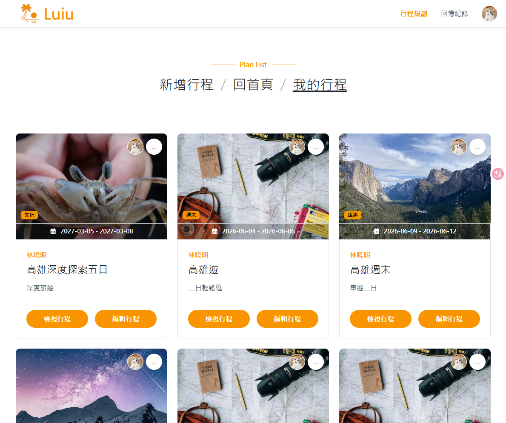
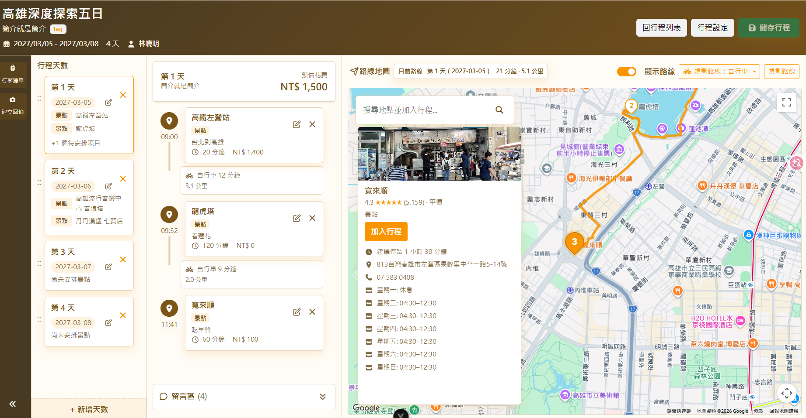
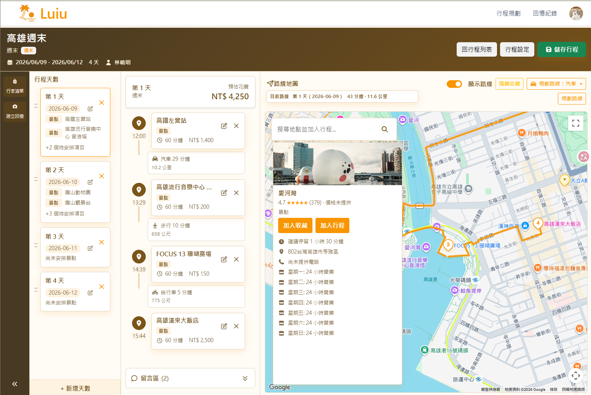
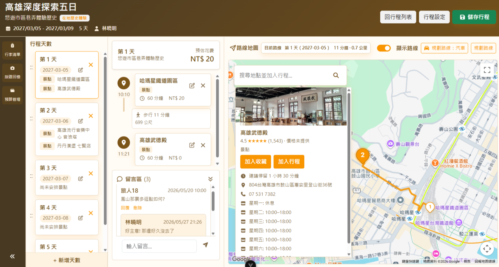
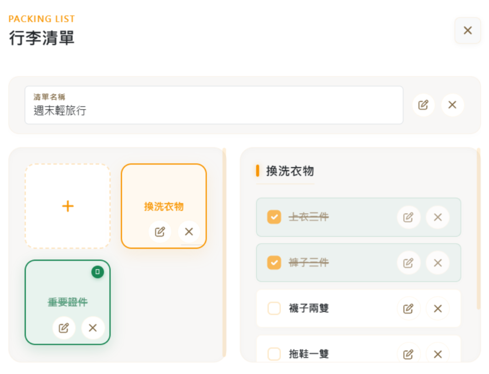
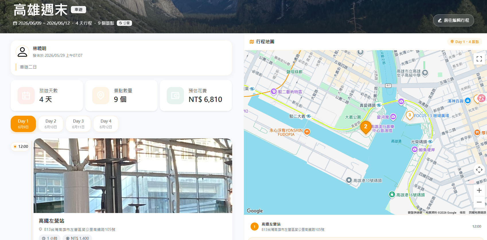
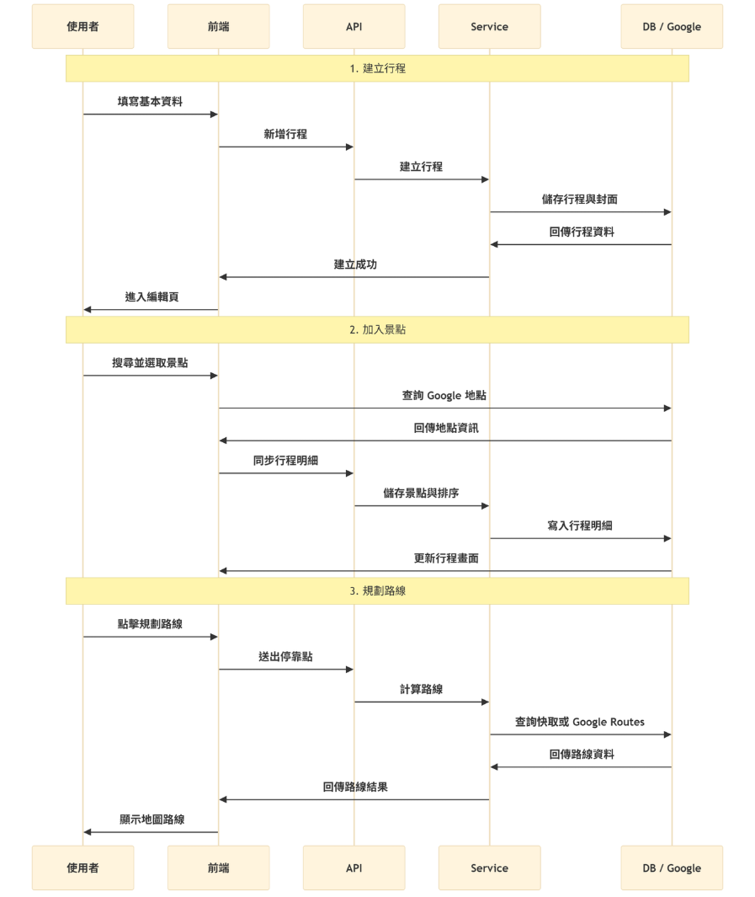
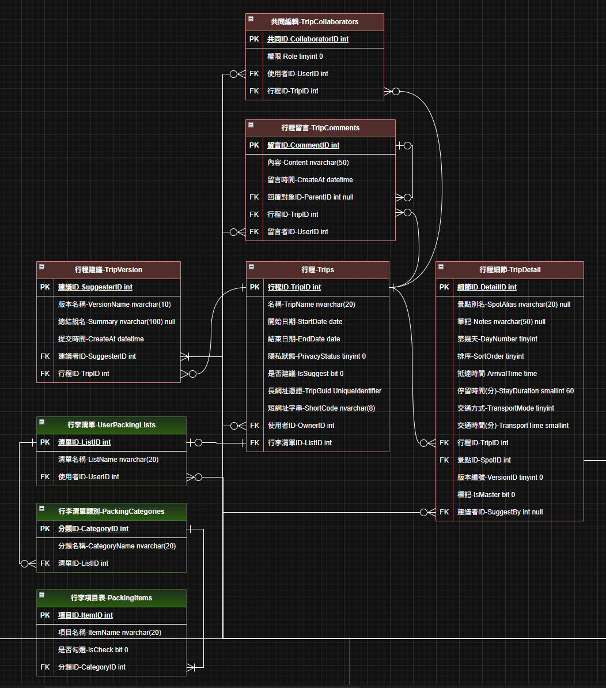

# Luiu

A modern travel planning platform for building itineraries, arranging attractions, planning routes, managing budgets, and collaborating with other travelers.

Originally developed as a three-person graduation project, Luiu is now maintained independently as my personal portfolio project for full-stack development, deployment, cloud services, and software engineering practices.

## Screenshots and Diagrams

| Preview                                                                           | Description                                                                |
| --------------------------------------------------------------------------------- | -------------------------------------------------------------------------- |
|                                | Trip card preview with travel dates and action buttons.                    |
|                                      | Personal trip list with card-based itinerary management.                   |
|              | Itinerary editor with day cards, stops, route planning, and Google Maps.   |
|      | Weekend itinerary editor showing route planning and saved places.          |
|    | Itinerary editor with comments, route display, and place details.          |
|                              | Packing list modal for categories and checklist items.                     |
|          | Public itinerary detail page with trip summary, route map, and stops.      |
|  | Sequence flow for creating trips, adding attractions, and planning routes. |
|                      | ERD for itinerary planning, comments, collaboration, and packing lists.    |

## Features

- **Itinerary Management**
  - Create, edit, delete, and manage personal travel plans.
  - Set travel dates, descriptions, privacy status, tags, and cover images.
  - View all itineraries through a card-based trip list.

- **Interactive Itinerary Planner**
  - Arrange attractions by day.
  - Drag and drop attractions to adjust the travel order.
  - Move entire days while keeping the related attractions together.
  - Automatically calculate daily budget totals from planned expenses.

- **Google Maps Integration**
  - Search attractions through Google Places.
  - Display selected attractions on an interactive map.
  - Store location data such as Google Map ID, address, latitude, longitude, rating, and photos.
  - Reduce repeated external API calls by reusing stored attraction data.

- **Route Planning**
  - Plan routes between attractions using Google Routes API.
  - Support multiple travel modes such as driving, walking, cycling, transit, and two-wheeler.
  - Allow per-segment transportation settings.
  - Cache route results to reduce repeated Google API requests.

- **Packing List**
  - Attach packing lists to trips.
  - Organize items by category.
  - Track checked and unchecked items before departure.

- **Sharing and Collaboration**
  - Share public itinerary pages through links.
  - Allow other users to view, comment, reply, and collect itineraries.
  - Show different actions based on user role, such as collect, edit, or recommend.

- **Admin Recommendation**
  - Admin users can mark high-quality itineraries as recommended content.
  - Recommended trips can be displayed in public-facing sections of the platform.

## Tech Stack

### Frontend

- Vue 3
- Vite
- JavaScript
- Bootstrap
- Pinia
- SortableJS
- Google Maps JavaScript API

### Backend

- ASP.NET Core Web API
- C#
- Entity Framework Core
- DTO / Service / Controller layered architecture
- JWT-based authentication
- RESTful API design

### Database

- SQL Server
- Relational schema design
- Trip, trip detail, attraction, comment, favorite, packing list, and route cache tables

### Third-party APIs

- Google Maps JavaScript API
- Google Places API
- Google Routes API

## Project Structure

```txt
Luiu
├─ LFrontend   Vue 3 + Vite frontend application
├─ LBackend    ASP.NET Core Web API backend solution
├─ LDatabase   SQL Server database scripts and schema assets
└─ LDocs       Screenshots, diagrams, and documentation images
```

## Deployment

Luiu is currently being prepared for modern deployment as part of my continued learning process.

Planned deployment goals include:

- Deploying the frontend as a static web application.
- Deploying the ASP.NET Core Web API to a cloud environment.
- Hosting SQL Server or a compatible managed database.
- Managing environment variables and API keys securely.
- Adding production-ready configuration for CORS, authentication, logging, and monitoring.

## Project Architecture

Luiu uses a layered full-stack architecture.

```txt
LFrontend Vue App
  ├─ Views
  ├─ Components
  ├─ Composables
  ├─ Stores
  └─ API Clients
        ↓
LBackend ASP.NET Core Web API
  ├─ Controllers
  ├─ DTOs
  ├─ Services
  ├─ Mappings
  └─ Entity Framework Core
        ↓
LDatabase SQL Server Database
  ├─ Trips
  ├─ Trip Details
  ├─ Attractions
  ├─ Route Cache
  ├─ Comments
  ├─ Favorites
  └─ Packing Lists
        ↓
External Services
  ├─ Google Maps
  ├─ Google Places
  └─ Google Routes
```

### Core Data Flow

1. A user creates a trip from the frontend.
2. The frontend sends trip data to the backend API.
3. The backend validates the request and stores the trip in SQL Server.
4. The user searches for attractions through the map interface.
5. The backend checks whether the attraction already exists in the database.
6. If not found, the backend fetches location data from Google Places API.
7. The selected attraction is added to the itinerary as a trip detail.
8. Drag-and-drop changes update `DayNumber` and `SortOrder`.
9. Route planning uses the ordered attractions and selected travel modes.
10. Route results are returned to the frontend and cached when appropriate.

## Future Roadmap

- Refactor the itinerary editor into smaller, more maintainable components.
- Improve route planning error handling and fallback behavior.
- Add unsaved-change warnings when users leave the itinerary editor.
- Enhance automated testing for core itinerary workflows.
- Improve deployment pipeline and production configuration.
- Add richer public itinerary discovery and recommendation features.
- Improve mobile layout and responsive interaction design.
- Add more detailed budget management and trip expense summaries.

## About This Project

This project represents my transition into full-stack development.

Although my academic background is not in computer science, maintaining Luiu independently has helped me practice:

- Building real user-facing features.
- Designing frontend and backend data flow.
- Working with relational database relationships.
- Integrating third-party APIs.
- Handling permissions and user roles.
- Debugging complex UI state synchronization.
- Thinking about maintainability, deployment, and long-term improvement.

Luiu is not only a graduation project, but also an ongoing portfolio project where I continue to improve the codebase, practice deployment, and grow as a full-stack developer.
